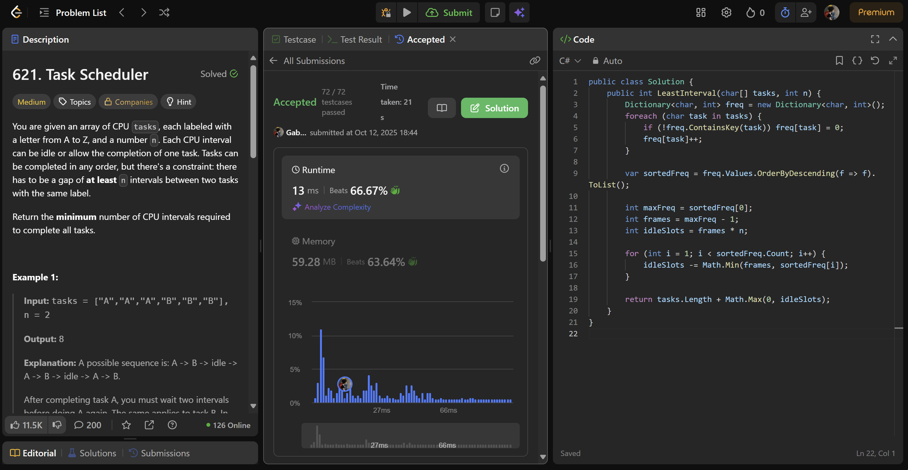
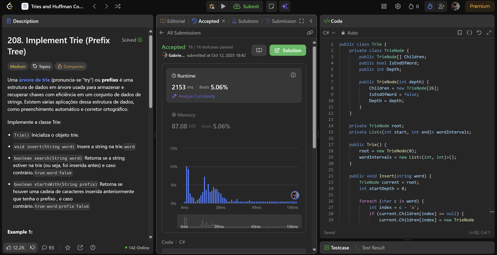

# LeetCodeQuestions - GREED

**Conteúdo da Disciplina**: Greed<br>

## Alunos

| Matrícula  | Aluno                |
| ---------- | -------------------- |
| 21/1031673 | Cauã Matheus         |
| 21/1030756 | Gabriela Silva Alves |

## Sobre

Este repositório apresenta soluções para quatro problemas do LeetCode, organizadas por linguagem e nível de dificuldade:

### C++
- [Question](https://leetcode.com/) **(Medium)**

- [Question](https://leetcode.com/) **(Hard)**

---

### C\#
- [621. Task Scheduler](https://leetcode.com/problems/task-scheduler/description/) **(Medium)**

- [208. Implement Trie (Prefix Tree)](https://leetcode.com/problems/implement-trie-prefix-tree/description/) **(Hard)**
## Screenshots

### Visualização 

#### C++

- Question


- Question


#### C\#
- Task Scheduler


- Implement Trie (Prefix Tree)


---

## Instalação

**Linguagem**: C++ e C# <br>

**Pré-requisitos:**

- .NET SDK: versão 10
- Ferramentas de linha de comando: git, bash (ou terminal equivalente)

## Passo a passo

### 1. Clone o repositório

### 2. Compilar e executar C++

Os comandos a seguir devem ser executados a partir da raiz do repositório clonado.
> OBS.: Para submssão em juízes como leetcode, submeter apenas classe Solution.

#### Executando as Soluções

#### **Questão **

Para compilar e executar a validação desta questão, utilize o makefile ou utilize o comando a seguir:

```bash
g++ ./solutions/cpp/question.cpp -o ./out.o && ./out.o && rm ./out.o
```

#### **Questão **

Para compilar e executar a validação desta questão, utilize o comando:

```bash
g++ ./solutions/cpp/question.cpp -o ./out.o && ./out.o && rm ./out.o
```

### 3. Compilar e executar soluções C#

Os comandos a seguir devem ser executados a partir da raiz do repositório clonado.
> OBS.: Para submssão em juízes como leetcode, submeter apenas classe Solution.

#### Executando as Soluções

#### **621. Task Scheduler**

Para compilar e executar a validação desta questão, utilize o comando:

```bash
dotnet run --project solutions/csharp/TaskScheduler
```

#### **208. Implement Trie (Prefix Tree)**

Para compilar e executar a validação desta questão, utilize o comando:

```bash
dotnet run --project solutions/csharp/ImplementTrie
```

## Apresentação

Vídeo disponível em: [Apresentação D16](https://youtu.be/)

## Outros

Para dúvidas, sugestões ou melhorias, entre em contato com os autores.


